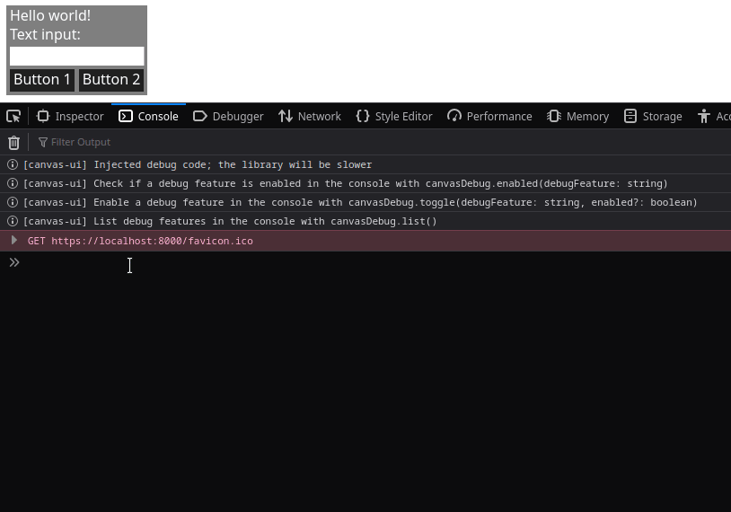
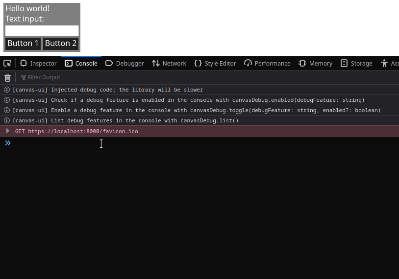

# canvas-ui

A Typescript UI library which uses HTML canvases.

Documentation is available on [Github pages](https://rafern.github.io/canvas-ui/).

Unity integration can be found in the 
[canvas-ui-unity repository](https://github.com/rafern/canvas-ui-unity).

three.js integration can be found in the 
[canvas-ui-three repository](https://github.com/rafern/canvas-ui-three).

Wonderland Engine integration can be found in the 
[canvas-ui-wl repository](https://github.com/rafern/canvas-ui-wl).

## Contributing

To check for linter errors, run `npm run lint`

To build this project, run `npm run build`

To build this project in watch mode and with unminified output run `npm run dev`

To re-generate the documentation, run `npm run docs`

To add/modify theme properties, modify the `theme_properties.json` file and run
`npm run generate_theme`

## Example

Examples can be found in the `examples` folder

## Debugging

Additional debugging tools are available in this project, such as:

- Visualisation of widget painting by using a random background fill colour when a widget is painted
  - **EPILEPSY WARNING** - This creates blocks of randomly flashing colours for widgets that update frequently
- Visualisation of text render groups to debug text wrapping issues
- Tracing recursive method calls, such as the `dispatchEvent` method
- Watching when flags are set, such as the `_dirty` or `_layoutDirty` flags
- Printing a grouped stack trace to the console when a specific method is called

Demonstration of the textrendergroups debug feature

Demonstration of the watchflag debug feature

Each of these features is identified by a name and can be individually toggled
and queried to check if they are enabled. All of the available features, called
debug features, can also be listed.

These features create additional overhead, even when disabled. Because of this,
the debugging tools are implemented as wrappers for method calls, and are
injected at runtime when needed. The wrappers can be injected by calling the
`injectDebugCode` function, which must first be imported. When the code is
injected, a new global object (`canvasDebug`) is available in the console and a
help message is printed to the console. This object has the following functions:

- `canvasDebug.list()`: Print a list of all of the available debug features
- `canvasDebug.toggle(debugFeature, enable)`: Toggle a debug feature identified by the `debugFeature` argument. `enabled` is an optional boolean argument; if set, then the feature is enabled or disabled depending on whether the argument is `true` or `false`, but if not set, then the feature is toggled
- `canvasDebug.enabled(debugFeature)`: Check whether a debug feature identified by the `debugFeature` argument is enabled. Returns true if enabled, false if not

These 3 functions can also be imported via the `listDebugFeatures`,
`toggleDebugFeature` and `isDebugFeatureEnabled` functions, but
`injectDebugCode` must still be called before using these functions.

## Special thanks

Special thanks to Playko ([website](https://www.playko.com/),
[github](https://github.com/playkostudios)) where this project started and is
currently being developed at.

## License

This project is licensed under the MIT license (see the LICENSE file)

This project uses the following open-source projects:
- [@typescript-eslint/eslint-plugin](https://github.com/typescript-eslint/typescript-eslint/tree/master/packages/eslint-plugin) licensed under the MIT license
- [@typescript-eslint/parser](https://github.com/typescript-eslint/typescript-eslint/tree/master/packages/parser) licensed under the BSD 2-Clause license
- [esbuild](https://github.com/evanw/esbuild) licensed under the MIT license
- [eslint](https://github.com/eslint/eslint) licensed under the MIT license
- [eslint-plugin-tree-shaking](https://github.com/lukastaegert/eslint-plugin-tree-shaking) licensed under the MIT license
- [local-web-server](https://github.com/lwsjs/local-web-server) licensed under the MIT license
- [typedoc](https://github.com/TypeStrong/TypeDoc) licensed under the Apache 2.0 license
- [typescript](https://github.com/Microsoft/TypeScript) licensed under the Apache 2.0 license
